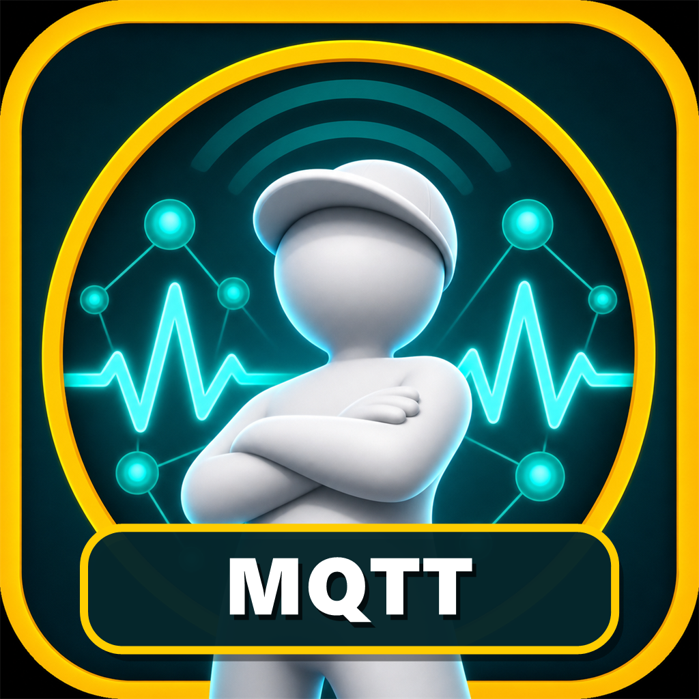

# mqttBoys

<p align="center">
  
</p>

`mqttBoys`는 빠르게 들어오는 MQTT 메시지를 가볍게 탐색하고 비교하기 위한 Windows 데스크톱 클라이언트입니다.

## 주요 기능

- 브로커와 폴더를 계층형으로 관리
- MQTT, WebSocket, TLS, 인증서 및 SSH 터널 연결
- 일치 경로만 남기는 토픽 트리 검색과 Publish 토픽 자동완성
- 최신 Value와 선택한 과거 메시지를 나란히 비교
- 토픽별 제한된 히스토리와 평균 전송 주기 표시
- 10초, 30초, 1분 및 직접 입력을 지원하는 정밀 주기 측정과 중단 결과 기록
- JSON 자동 정리, 구문 강조, 복사 및 Publish
- 연결 끊김 감지와 자동 재연결

## 다운로드

[Releases](../../releases)에서 최신 `mqttBoys.exe`를 내려받아 실행합니다. 별도 설치나 추가 런타임은 필요하지 않습니다.

현재 버전: **0.0.8**

## 지원 환경

- Windows 10/11 x64
- MQTT 3.1.1 및 MQTT 5 브로커

연결 프로필은 `%APPDATA%\MqttPulse\profiles.json`에 저장됩니다.

## 소스에서 빌드

.NET 10 SDK가 필요합니다.

```powershell
dotnet test .\MqttPulse.Tests\MqttPulse.Tests.csproj -c Release
dotnet publish .\MqttPulse.App\MqttPulse.App.csproj -c Release -r win-x64 --self-contained true -o .\publish
```

## 릴리스

`v*` 형식의 태그를 푸시하면 GitHub Actions가 테스트 후 Windows x64 단일 실행 파일을 빌드하여 Release에 첨부합니다.

```powershell
git tag v0.0.8
git push origin v0.0.8
```
